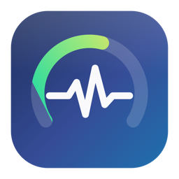
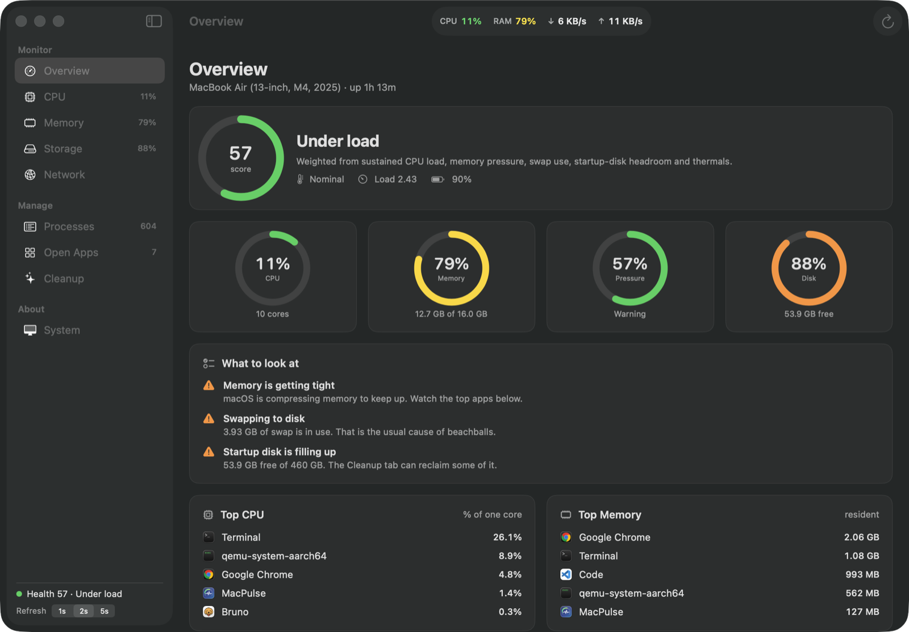

<p align="center">
  
</p>

# MacPulse

A native macOS performance monitor — CPU, memory, storage, network, processes,
running apps, and a cache cleaner — in one SwiftUI app.

Everything is measured locally through Mach, `sysctl` and IOKit. Nothing is sent
anywhere, and the app has no network code at all.



## Build and run

```bash
./build.sh
open build/MacPulse.app
```

`build.sh` compiles the SwiftPM target, renders the icon, assembles
`build/MacPulse.app` and ad-hoc signs it. Requires Xcode command line tools;
no Xcode project needed.

To keep it around:

```bash
cp -R build/MacPulse.app /Applications/
```

## What each panel shows

**Overview** — a 0–100 health score weighted by sustained CPU load, memory
pressure, swap use, startup-disk headroom and thermal state, plus a plain-language
list of what actually needs attention and the top CPU and memory consumers.

**CPU** — total utilisation split into user/system/idle, 1/5/15-minute load
averages, performance vs. efficiency cluster load on Apple silicon, every logical
core individually, and the top processes.

**Memory** — memory *pressure* (the number that actually predicts beachballs)
alongside the Activity Monitor breakdown: app memory, wired, compressed, cached
files and free. Plus swap, compressions and page-outs.

**Storage** — per-volume capacity, purgeable space, and live read/write
throughput read from `IOBlockStorageDriver`.

**Network** — up/down throughput with history, and a per-interface table with
byte counts and error counts.

**Processes** — every process on the machine, sortable and filterable, with Quit
(SIGTERM) and Force (SIGKILL) per row. Apps get AppKit's polite termination so
they can prompt about unsaved work; everything else is signalled directly.

**Open Apps** — running apps with their icons, where CPU and memory are rolled up
across each app's helper processes, so a browser's number reflects its tabs.

**Cleanup** — measures regenerable caches and logs, and removes the ones you tick.

**System** — model, chip, core layout, GPU cores, memory, macOS build, uptime,
full battery detail (condition, cycle count, capacity, temperature), the
**Start at login** switch, and **temperature**: SoC, battery and SSD, with a
trend chart and every individual sensor.

The menu bar carries a two-line readout — CPU used/idle and RAM used/free, with
SoC temperature alongside — and a popover with the same headline numbers, the top
apps, and the login-item switch.

## How the cleaner stays safe

Deleting files is the only irreversible thing here, so it is fenced in:

- **Fixed allow-list.** Only the locations listed in `CacheScanner.targets` are
  ever candidates. There is no free-text path entry.
- **Home directory only.** `isPermitted` re-checks every path at delete time and
  refuses anything that is not strictly inside `$HOME` — the home directory
  itself included.
- **Contents only.** The folder is kept; only what is inside it is removed.
- **Apple's guarded folders are skipped** while both scanning and cleaning
  (Music, Photos, Mail, Safari and friends). They are managed by macOS, and
  touching them triggers privacy prompts.
- **Risk is labelled.** `Safe`, `Rebuilds` and `Careful`. Only the first two are
  pre-selected; Trash and Xcode Archives are never ticked for you.
- **Confirmation names the cost** in bytes before anything is removed, and
  "Move to Trash instead of deleting" makes the whole thing reversible.
- Files an app still has open simply stay put and are reported afterwards.

`Tests/CleanupTests.swift` covers exactly these guarantees:

```bash
swiftc -parse-as-library Sources/MacPulse/Core/CacheScanner.swift \
    Sources/MacPulse/Core/Sysctl.swift Tests/CleanupTests.swift \
    -o /tmp/cleanup-tests && /tmp/cleanup-tests
```

## Where the numbers come from

| Metric | Source |
| --- | --- |
| Per-core CPU | `host_processor_info(PROCESSOR_CPU_LOAD_INFO)`, diffed between samples |
| P/E core split | `hw.perflevel0.logicalcpu` / `hw.perflevel1.logicalcpu` |
| Load average | `getloadavg` |
| Memory | `host_statistics64(HOST_VM_INFO64)`, `hw.memsize`, `vm.swapusage` |
| Memory pressure | `kern.memorystatus_vm_pressure_level` |
| Volumes | `mountedVolumeURLs` + `volumeAvailableCapacityForImportantUsage` |
| Disk I/O | IOKit `IOBlockStorageDriver` statistics |
| Network | `getifaddrs` → `if_data` counters, converted to rates |
| Battery | `IOPSCopyPowerSourcesInfo` + IORegistry `AppleSmartBattery` |
| Thermals | `ProcessInfo.thermalState` |
| Model name | IORegistry `IODeviceTree:/product` |
| Temperature | `IOHIDEventSystemClient`, usage page `0xff00` / usage `5`, event type 15 |
| Processes | `ps -axo …` — the kernel only gives full per-process accounting for other users' processes to root, and `ps` reports on all of them without elevation |

## Notes

- The app is **not sandboxed**, which is what lets it read the full process table
  and delete caches. It is ad-hoc signed, so macOS may warn if you move the
  bundle to another machine.
- **Closing the window hides the Dock icon.** The activation policy follows the
  window: `.regular` while one is on screen, `.accessory` when none is, so
  MacPulse drops to the menu bar instead of leaving an idle Dock tile. Reopening
  from the popover, Spotlight or Finder brings the icon straight back.
- Refresh rate is switchable between 1s, 2s and 5s in the sidebar footer. A slow
  sample can never pile up — a frame is skipped instead.
- Closing the window leaves the app running in the menu bar. Quit from the menu
  bar popover or ⌘Q.

### Starting at login

`SystemInfoView`'s Startup card and the menu bar popover both toggle
`SMAppService.mainApp`, the supported macOS 13+ API. The registration is recorded
against one exact bundle, so **register the copy in `/Applications`**, not a copy
in `build/` — moving or renaming a registered app invalidates it and the status
line will say so.

When macOS starts the app as a login item it marks the launch event with
`keyAELaunchedAsLogInItem`. The app watches for that and closes its window on
startup, so a login launch puts the readout in the menu bar without a window
taking over the screen. Opening the app yourself behaves normally.

If the login item is ever blocked, the status line says so and offers a button to
System Settings › General › Login Items, which is the only place a manual block
can be lifted.

### Testing hooks

Two environment variables, used while developing and kept because they are handy:

```bash
open -n --env MACPULSE_PANEL=cleanup build/MacPulse.app            # open to a panel
open -n --env MACPULSE_SCAN_ONLY=xcode-derived build/MacPulse.app  # scan one location
open -n --env MACPULSE_LOGIN_ITEM=register /Applications/MacPulse.app  # register/unregister
```
